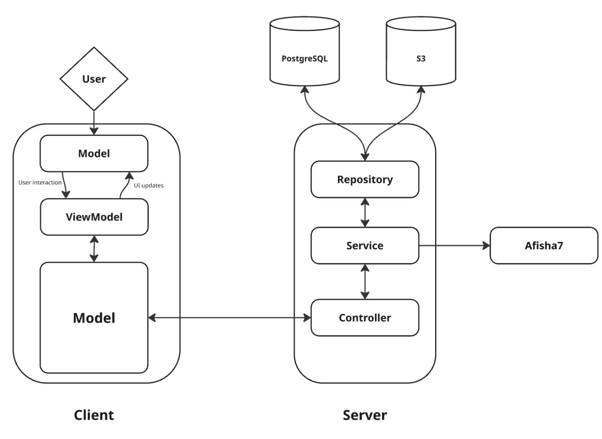

# El-GuPo

### About

El-GuPo is a Java-based RESTful application designed to help users find companions for joint event attendance. The application consists of two main components: a client application and a server application.

**Key Features:**
- Find event companions and hiking partners
- RESTful API architecture for seamless communication
- User-friendly interface for browsing and connecting with potential companions
- Secure user authentication and profile management

**Technology Stack:**
- **Backend:** Java with RESTful API
- **Frontend:** Client application for user interaction
- **Architecture:** Client-Server model with RESTful communication

The application serves as a social platform that connects people who share similar interests in events and outdoor activities, making it easier to find like-minded companions for various activities and adventures.

### Components

* [El-Gupo](https://github.com/El-GuPo/ElGuPo)
* [ElGuPoServer](https://github.com/El-GuPo/ElGuPoServer)

### Architecture

### Screenshots 

     
    
    

### Authors

* [Georgii Gubanov](https://github.com/Spydula)
* [Miron Eliseev](https://github.com/mrnchk)
* [Aleksandr Podmarev](https://github.com/apdRV)

